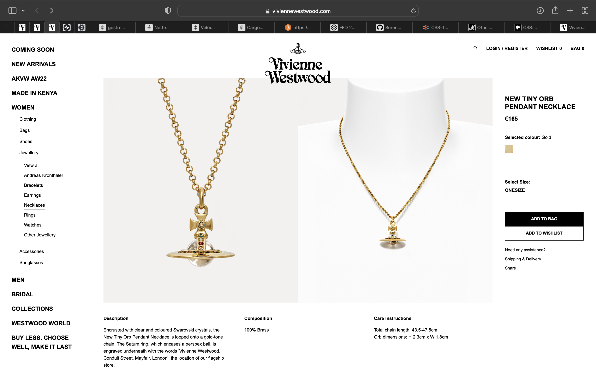
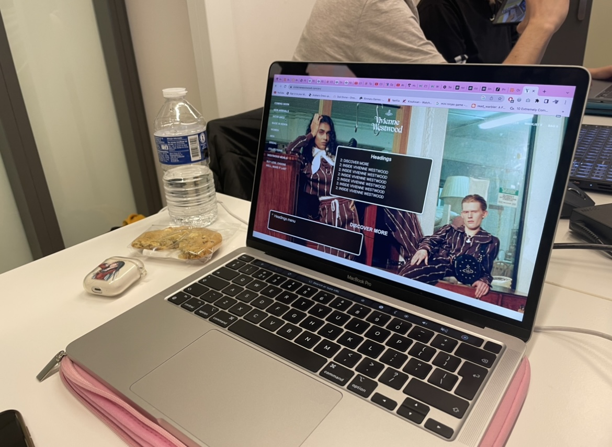
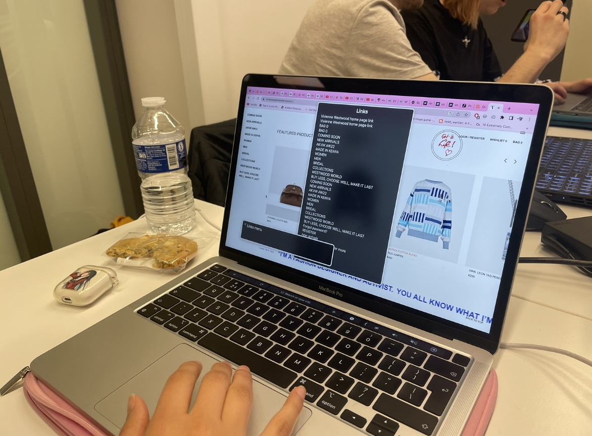
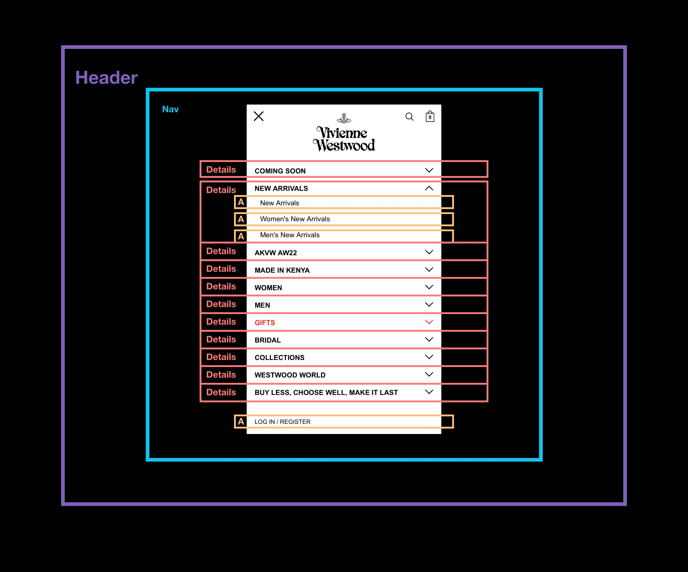
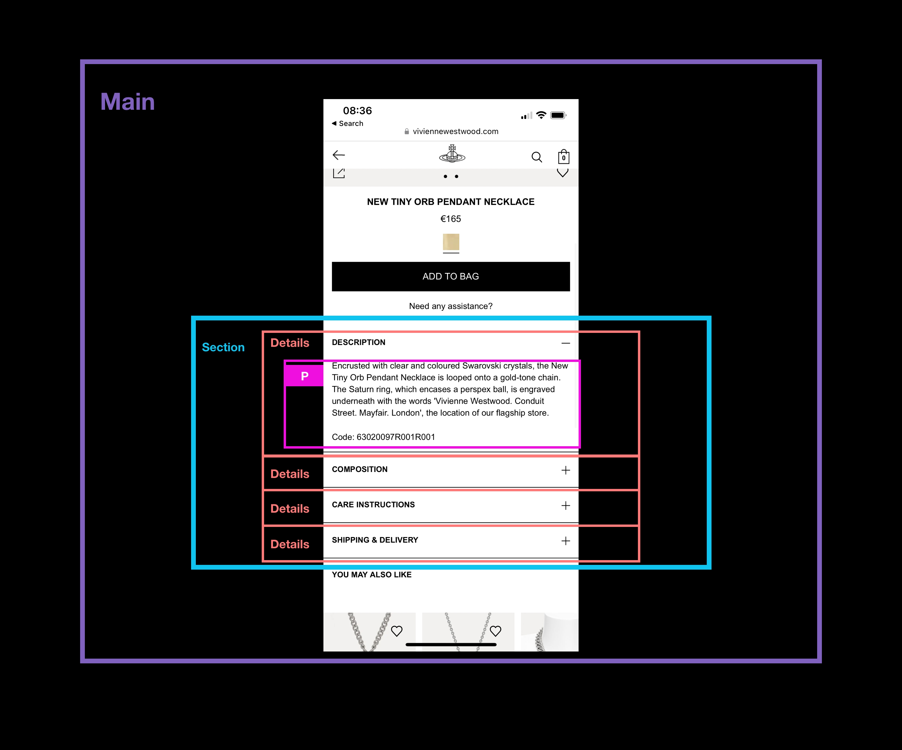

# Procesverslag
Markdown is een simpele manier om HTML te schrijven.  
Markdown cheat cheet: [Hulp bij het schrijven van Markdown](https://github.com/adam-p/markdown-here/wiki/Markdown-Cheatsheet).

Nb. De standaardstructuur en de spartaanse opmaak van de README.md zijn helemaal prima. Het gaat om de inhoud van je procesverslag. Besteedt de tijd voor pracht en praal aan je website.

Nb. Door *open* toe te voegen aan een *details* element kun je deze standaard open zetten. Fijn om dat steeds voor de relevante stuk(ken) te doen.

## Jij

  
uitwerken voor kick-off werkgroep

  ### Auteur:
  Jeannet Welboren

  #### Je startniveau:
  Rood

  #### Je focus:
  Responsive
 

## Je website

  
uitwerken voor kick-off werkgroep

  ### Je opdracht:
  https://www.viviennewestwood.com/en/

  #### Screenshot(s) van de eerste pagina (small screen): 
  Home pagina 
  

  #### Screenshot(s) van de tweede pagina (small screen):
  Tiny orb pendant necklace 
  
 

## Toegankelijkheidstest 1/2 (week 1)

  
uitwerken na test in 1e werkgroep

  ### Bevindingen
  Lijst met je bevindingen die in de test naar voren kwamen:
  Wat mij opviel was dat de website van Vivienne Westwood niet gebruiks vriendelijk is voor mensen met 
  een beperking. De screen readers pakken hele rare dingen op, de focus state is amper zichtbaar en door de 
  site heen tappen is een drama.

  #### Screenreader
  

- De site van Vivienne Westwood is niet gemaakt voor een screen reader. Het pakte ook elementemn op axhter een  
  afbeelding die niet eens aanwezig waren en dat maakt het heel ongebruiksvriendelijk. De headings zijn steeds het
  zelfde en worden herhaald. Daarnaast kloppen niet alle linkjes die worden weergeven door de
  screen reader en worden ze ook herhaald. 

  

  Hoe dit opgelost zou worden is door goed aan te geven wat de headings zijn in de code.
  Ook kan er gekeken worden naar het gebruik van linkjes en die duidelijker maken voor de mensen
  die een screenreader gebruiken.

  #### Muis en Toetsenbord 
  De Vivienne Westwood site is behoorlijk slecht te navigeren met tabs. 
  Je zou verwachten van een duur merk dat ze daar wel wat mee zouden doen aangezien er genoeg
  budget voor is. Maar de focus state is voor 99% van de tijd niet zichtbaar. Alleen bij een button heb
  ik heb gezien en die is ook slecht gedesigned. 
  
  Hoe dit opgelost zou kunnen worden is door een goede focusstate te kunnen designen die 
  duidelijk aanwezig is en alles pakt wat nodig is.

  #### Motoriek (shocks, elastiekjes)
  De site navigeren met de Spasmes parkinson simulator was interessant. Ik heb Soraya door mijn site heen laten navigeren en je merkte dat zij perongeluk steeds een hele sectie door scrolde. Ook heeft ze moeite met het aanklikken van de kleine linkjes. "Het lukt maar moeilijk".

  Daarnaast heeft Soraya ook met elestiekjes gerpobeerd om door mijn site heen te lopen en het was eerst even zoeken hoe ze haar mobiel vast moest houden. Voor de rest verliep het navigeren van de site best wel goed alleen zijn sommige linkjes wel heel klein en dat maakte het lastiger.

  Wat er aan de site zou kunnen veranderen is om sommige linkjes wat groter te maken zodat die makkelijker klikbaar zijn aangezien sommige heel klein zijn. Het is best een minimalistische website.

  #### Visueel (brillen, contrast, kleurenblind, dark/light). 
  Soraya heeft ook mijn site getest met een central field loss bril. Hieruit is gebleken dat zij de bovenkant van de pagina wel kon zien maar de onderkant niet. Hierdoor had ze moeite met het zien wat er volgt. 

  Daarnaast heb ik de site ook nog getest met de kleurenblindheid functies van Chrome. Daaruit kwam dat de site daar goed rekening mee houdt. Het contrast is hoog genoeg en er is duidelijk verschil tussen alle elementen. Voornamelijk omdat er zwart en wit wordt gebruikt en alleen in de afbeeldingen echt kleur zit.

  Wat er verbeterd zou kunnen worden is om op mobiel duidelijer te maken wat bij wat hoort. Dus dat je duidelijk de heading ziet staat.

## Breakdownschets (week 1)

  
uitwerken na afloop 2e werkgroep

  ### de hele pagina: 
  

  ### dynamisch deel (bijv menu): 
  

  ### wellicht nog een dynamisch deel (bijv filter): 
  

## Voortgang 1 (week 2)

  
uitwerken voor 1e voortgang

  ### Stand van zaken
  Dit ging goed:
  De meeste opdrachten zijn wel soepel verlopen en als ik ergens tegaan liep kon ik het vaak ook zelfn oplossen. 
  De Flexbox froggy en grid garden zijn bij mij helemaal gelukt en ik vind dat ook een fijne manier om code te leren. 

  Dit vond ik lastig:
  De meeste stukken van de code ging best goed. Allen had ik probelemen met de grid cards oefening. Toen in die voor het eerst dee pakte die mijn grid niet en toen Vasilisis het voor dee in de klas had ik precies de zelfde code gebruikt dus er was wat met mijn code pen aan de hand.Verder heb ik nog geen code geschreven voor mijn eoigen website omdat ik een beetje achterloop vanwege een drukke agenda maar ik zorg dat ik volgende week goed op weg ben.

  ### Agenda voor meeting
  samen met je groepje opstellen

  | Sasja                                       | Jeannet              | Mischa              | Naim   |
  | ---                                         | ---                  | ---                 | ---    |
  | Hamburger menu als scherm klein genoeg is   | Dynamische breakdown | Witruimte website   | ...    |
  | Wanneer flexbox,grid of position  gebruiken | Video in readme      | ...                 | ...    |
  |                                             | ...                  | ...                 | ...     |

  ### Verslag van meeting
  hier na afloop snel de uitkomsten van de meeting vastleggen

  - Detail element gebruiken voor een uitklapbaar item inplaats van een A.
  - Hamburger menu door java script, krijgen we later uitleg van in de les.
  - Gifjes gebruiken inplaats van video's en anders een youtube linkje.

## Voortgang 2 (week 3)

  
uitwerken voor 2e voortgang

  ### Stand van zaken
  hier dit ging goed & dit was lastig (neem ook screenshots op van delen van je website en code)

  ### Agenda voor meeting
  samen met je groepje opstellen

  | Jeannet                                 | Sasja              | Misha            | Naim             |
  | ---                                     | ---                | ---              | ---              |
  | Header scrollen dat die kleiner wordt   | en dit             | en ik dit        | ...              |
  | Fixed header gaat achter content door   | nog een punt       | dit wil ik zeker | ...              |
  | Hamburgermenu het logo & cart zien      | ...                | ...              | ...              |

  ### Verslag van meeting
  hier na afloop snel de uitkomsten van de meeting vastleggen

  - punt 1
  - punt 2
  - nog een punt
- ...

## Toegankelijkheidstest 2/2 (week 4)

  
uitwerken na test in 8e werkgroep

  ### Bevindingen
  Lijst met je bevindingen die in de test naar voren kwamen (geef ook aan wat er verbeterd is):

  #### Screenreader
  Hier korte omschrijving (met indien nodig afbeeldingen)

  Hier een omschrijving van hoe het opgelost kan worden (met indien nodig afbeeldingen)

  #### Muis en Toetsenbord 
  Hier korte omschrijving (met indien nodig afbeeldingen)

  Hier een omschrijving van hoe het opgelost kan worden (met indien nodig afbeeldingen)

  #### Motoriek (shocks, elastiekjes)
  Hier korte omschrijving (met indien nodig afbeeldingen)

  Hier een omschrijving van hoe het opgelost kan worden (met indien nodig afbeeldingen)

  #### Visueel (brillen, contrast, kleurenblind, dark/light). 
  Hier korte omschrijving (met indien nodig afbeeldingen)

  Hier een omschrijving van hoe het opgelost kan worden (met indien nodig afbeeldingen)

## Voortgang 3 (week 4)

  
uitwerken voor 3e voortgang

  ### Stand van zaken
  hier dit ging goed & dit was lastig (neem ook screenshots op van delen van je website en code)

  ### Agenda voor meeting
  samen met je groepje opstellen

  | student 1      | student 2          | student 3    | student 4        |
  | ---            | ---                | ---          | ---              |
  | dit bespreken  | en dit             | en ik dit    | en dan ik dat    |
  | en dat ook nog | dit als er tijd is | nog een punt | dit wil ik zeker |
  | ...            | ...                | ...          | ...              |

  ### Verslag van meeting
  hier na afloop snel de uitkomsten van de meeting vastleggen

  - punt 1
  - punt 2
  - nog een punt
  - ...

## Eindgesprek (week 5)

  
uitwerken voor eindgesprek

  ### Je uitkomst - karakteristiek screenshots:
  

  ### Dit ging goed/Heb ik geleerd: 
  Korte omschrijving met plaatjes

  

  ### Dit was lastig/Is niet gelukt:
  Korte omschrijving met plaatjes

  

## Bronnenlijst

  
continu bijhouden terwijl je werkt

  Nb. Wees specifiek ('css-tricks' als bron is bijv. niet specifiek genoeg).

  1. bron 1
  2. bron 2
  3. ...

