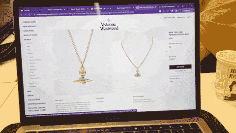
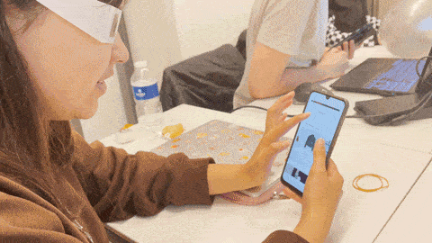
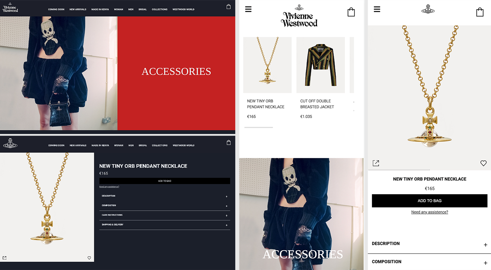
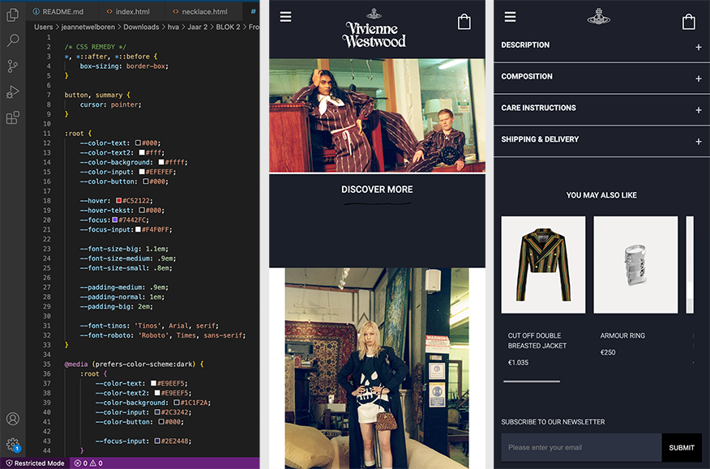
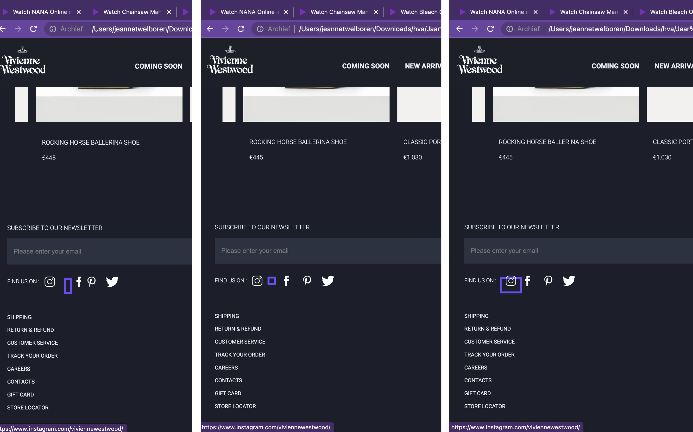

# Procesverslag
Markdown is een simpele manier om HTML te schrijven.  
Markdown cheat cheet: [Hulp bij het schrijven van Markdown](https://github.com/adam-p/markdown-here/wiki/Markdown-Cheatsheet).

Nb. De standaardstructuur en de spartaanse opmaak van de README.md zijn helemaal prima. Het gaat om de inhoud van je procesverslag. Besteedt de tijd voor pracht en praal aan je website.

Nb. Door *open* toe te voegen aan een *details* element kun je deze standaard open zetten. Fijn om dat steeds voor de relevante stuk(ken) te doen.

## Jij

  
uitwerken voor kick-off werkgroep

  ### Auteur:
  Jeannet Welboren

  #### Je startniveau:
  Rood

  #### Je focus:
  Responsive
 

## Je website

  
uitwerken voor kick-off werkgroep

  ### Je opdracht:
  https://www.viviennewestwood.com/en/

  #### Screenshot(s) van de eerste pagina (small screen): 
  Home pagina 
  

  #### Screenshot(s) van de tweede pagina (small screen):
  Tiny orb pendant necklace 
  
 

## Toegankelijkheidstest 1/2 (week 1)

  
uitwerken na test in 1e werkgroep

  ### Bevindingen
  Lijst met je bevindingen die in de test naar voren kwamen:
  Wat mij opviel was dat de website van Vivienne Westwood niet gebruiks vriendelijk is voor mensen met 
  een beperking. De screen readers pakken hele rare dingen op, de focus state is amper zichtbaar en door de 
  site heen tappen is een drama.

  #### Screenreader
  

  De site van Vivienne Westwood is niet gemaakt voor een screen reader. Het pakte ook elementemn op axhter een  
  afbeelding die niet eens aanwezig waren en dat maakt het heel ongebruiksvriendelijk. De headings zijn steeds het
  zelfde en worden herhaald. Daarnaast kloppen niet alle linkjes die worden weergeven door de
  screen reader en worden ze ook herhaald. 

  

  Hoe dit opgelost zou worden is door goed aan te geven wat de headings zijn in de code.
  Ook kan er gekeken worden naar het gebruik van linkjes en die duidelijker maken voor de mensen
  die een screenreader gebruiken.

  #### Muis en Toetsenbord 
  

  De Vivienne Westwood site is behoorlijk slecht te navigeren met tabs. 
  Je zou verwachten van een duur merk dat ze daar wel wat mee zouden doen aangezien er genoeg
  budget voor is. Maar de focus state is voor 99% van de tijd niet zichtbaar. Alleen bij een button heb
  ik heb gezien en die is ook slecht gedesigned. 
  
  Hoe dit opgelost zou kunnen worden is door een goede focusstate te kunnen designen die 
  duidelijk aanwezig is en alles pakt wat nodig is.

  #### Motoriek (shocks, elastiekjes)
  

  De site navigeren met de Spasmes parkinson simulator was interessant. Ik heb Soraya door mijn site heen laten navigeren en je merkte dat zij perongeluk steeds een hele sectie door scrolde. Ook heeft ze moeite met het aanklikken van de kleine linkjes. "Het lukt maar moeilijk".

  Daarnaast heeft Soraya ook met elestiekjes gerpobeerd om door mijn site heen te lopen en het was eerst even zoeken hoe ze haar mobiel vast moest houden. Voor de rest verliep het navigeren van de site best wel goed alleen zijn sommige linkjes wel heel klein en dat maakte het lastiger.

  Wat er aan de site zou kunnen veranderen is om sommige linkjes wat groter te maken zodat die makkelijker klikbaar zijn aangezien sommige heel klein zijn. Het is best een minimalistische website.

  #### Visueel (brillen, contrast, kleurenblind, dark/light). 
  

  Soraya heeft ook mijn site getest met een central field loss bril. Hieruit is gebleken dat zij de bovenkant van de pagina wel kon zien maar de onderkant niet. Hierdoor had ze moeite met het zien wat er volgt. 

  Daarnaast heb ik de site ook nog getest met de kleurenblindheid functies van Chrome. Daaruit kwam dat de site daar goed rekening mee houdt. Het contrast is hoog genoeg en er is duidelijk verschil tussen alle elementen. Voornamelijk omdat er zwart en wit wordt gebruikt en alleen in de afbeeldingen echt kleur zit.

  Wat er verbeterd zou kunnen worden is om op mobiel duidelijer te maken wat bij wat hoort. Dus dat je duidelijk de heading ziet staat.

## Breakdownschets (week 1)

  
uitwerken na afloop 2e werkgroep

  ### de hele pagina: 
  

  ### dynamisch deel (bijv menu): 
  

  ### wellicht nog een dynamisch deel (bijv filter): 
  

## Voortgang 1 (week 2)

  
uitwerken voor 1e voortgang

  ### Stand van zaken
  Dit ging goed:
  De meeste opdrachten zijn wel soepel verlopen en als ik ergens tegaan liep kon ik het vaak ook zelfn oplossen. 
  De Flexbox froggy en grid garden zijn bij mij helemaal gelukt en ik vind dat ook een fijne manier om code te leren. 

  Dit vond ik lastig:
  De meeste stukken van de code ging best goed. Allen had ik probelemen met de grid cards oefening. Toen in die voor het eerst dee pakte die mijn grid niet en toen Vasilisis het voor dee in de klas had ik precies de zelfde code gebruikt dus er was wat met mijn code pen aan de hand.Verder heb ik nog geen code geschreven voor mijn eoigen website omdat ik een beetje achterloop vanwege een drukke agenda maar ik zorg dat ik volgende week goed op weg ben.

  ### Agenda voor meeting
  samen met je groepje opstellen

  | Sasja                                       | Jeannet              | Mischa              | Naim   |
  | ---                                         | ---                  | ---                 | ---    |
  | Hamburger menu als scherm klein genoeg is   | Dynamische breakdown | Witruimte website   | ...    |
  | Wanneer flexbox,grid of position  gebruiken | Video in readme      | ...                 | ...    |
  |                                             | ...                  | ...                 | ...    |

  ### Verslag van meeting
  hier na afloop snel de uitkomsten van de meeting vastleggen

  - Detail element gebruiken voor een uitklapbaar item inplaats van een A.
  - Hamburger menu door java script, krijgen we later uitleg van in de les.
  - Gifjes gebruiken inplaats van video's en anders een youtube linkje.

## Voortgang 2 (week 3)

  
uitwerken voor 2e voortgang

  ### Stand van zaken
  Wat ging goed:
  Deze week had ik een goede start gemaakt met code. Mijn eerste pagina is bijna helemaal af. 
  Liep niet tegen heel veel dingen aan maar het was gewoon even opstarten en daarna ging de rest van zelf best aardig goed!
  Alles moet wel nog responsive worden maar dat doe ik pas als de andere pagina ook klaar is.

  Dit vond ik lastig:
  javascript. Ik heb daar nog steeds moeite mee om die te snappen. Het koste me heel veel moeite om bij de hamburger menu goed door te krijgen
  wat ik nou precies moest doen. Maar uiteindelijk na een beetje hulp van een collega van mij op werk ben ik eruit gekomen. 
  Het drong niet tot me door dat iets een class was in de css waardoor ik helemaal in de war raakte.

  ### Agenda voor meeting
  samen met je groepje opstellen

  | Jeannet                                 | Sasja                                                              | Misha                                | Naim |
  | ---                                     | ---                                                                | ---                                  | ---  |
  | Header scrollen dat die kleiner wordt   | lijnen tussen sommige stukken                                      | 2 p's onderelkaar                    | ...  |
  | Fixed header gaat achter content door   | Stukken in het midden krijgen, ook als het scherm groter word      | Een deel van de foto zichtbaar maken | ...  |
  | Hamburgermenu het logo & cart zien      | plaatje met tekst onder elkaar, maar als het scherm groot genoeg   | Iets met de LI                       | ...  |
  | Index opnieuw upgeload maar oude versie | is dat dan het plaatje en de tekst naar elkaar staan               | ...                                  | ...  |

  ### Verslag van meeting
  hier na afloop snel de uitkomsten van de meeting vastleggen

  - Header kan met een on scroll in java kleiner worden. Maar dat pas doen als ik veel tijd over heb.
  - Door een z-index te zetten op de header gaat de content er niet overheen.
  - Het hoeft niet pixel perfect te zijn. Hamburgermenu ziet er goed uit. 
  - Met githun kan het en uur duren voordat het daar is upgeload.

  Feedback van anderen wat ik ook kan gebruiken:
  - margin-left & right auto om alles goed in het midden te krijgen met schalen.
  - je mag 2 apparte p's onder elkaar zetten.
  - Object fit cover om ervoor te zorgen dat maar een deel van de afbeelding zichtbaar wordt.

## Toegankelijkheidstest 2/2 (week 4)

  
uitwerken na test in 8e werkgroep

  ### Bevindingen
  Lijst met je bevindingen die in de test naar voren kwamen (geef ook aan wat er verbeterd is):
  Wat mij is opgevallen is dat mijn versie van de site een stuk beter te navigeren is dan de huidige site. 
  De huidige site heeft ook geen focus state waardoor het heel moielijk te zien is waar je precies bent. 
  Ook is mij opgevallen dat ik door alle alt tags heen moet lopen om te kijken hoe ik die kan verbeteren.
  In het algemeen had mijn testeer (Koen) niet heel veel problemen.

  #### Screenreader
  Toen Koen met de screenreader door mijn site heen ging gebeurde er wat raars met mijn winkelwagen. 
  Daarnaast hebben de images bij Featured products nog geen goede alttekst.
  Bij accessoires kwam ineens het woordt "hoofd" in beeld bij de screenreader.
  Het "find us in" stukje in de footer heeft om een of andere reden 9 onderdelen waar het doorheen gaat.

  Hoe dit opgelost zou kunnen worden is door te kijken of er misschien een fout staat in mijn code bij het winkelmandje.
  Ook ga ik door de html heen lopen om alle alt tags een goede beschrijving te geven.
  Waarom het woordt "hoofd" nou boven kwam zou ik niet weten.
  En ik ga kijken in de code of ik iets kan vinden waarom de Li niet goed wordt gepakt door de screen reader.
  

  #### Muis en Toetsenbord 
  Door de site heen tabben gaat best goed. Het pakt de goede volgorde en slaat geen linkjes over. Alleen is er nog geen mooie focus state.

  Hoe dit opgelost zou kunnen worden is door de focus state een goed design te geven.

  #### Motoriek (shocks, elastiekjes)
  Door de site heen lopen met de elastiekjes en de shochks ging eigenlijk best goed.
  Koen had daar niet echt problemen mee gelukkig. Ook niet bij de mobile versie met de elastiekjes.
  Alles was voor hem groot genoeg om te klikken en er zat genoeg ruimte eromheen.

  #### Visueel (brillen, contrast, kleurenblind, dark/light). 
  Hier korte omschrijving (met indien nodig afbeeldingen)
  Koen heeft mijn site gestest met een wazige bril. Hierdoor zag hij het contrast goed van de site. 
  Dat komt ook omdat het allemaal zwart en wit is en de afbeeldingen eigenlijk alleen echt kleur hebben.
  Dus in dat geval gaat het goed en hoeft er niet iets verbetered te worden. Daarnaast is alles ook goed zichtbaar bij de kleurenblind modes.

## Voortgang 3 (week 4)

  
uitwerken voor 3e voortgang

  ### Stand van zaken
  Wat ging goed:
  Ik heb de 2e pagina ook helemaalk af gekregen en had een grote start gemaakt om alles responsive te krijgen. 
  Het was even spelen om de goede breakpoints te vinden zodat mijn site mooi gaat schalen maar dat is goed komen.

  Dit vond ik lastig:
  Waar ik heel veel moeite mee had was om de "necklace" pagina goed responsive te maken. Voornamnelijk het eerste gedeelte met de afbeelding, 
  buy now en de details. 

  ### Agenda voor meeting
  samen met je groepje opstellen

  | Jeannet                                           | Sasja                | Mischa               | Naim |
  | ---                                               | ---                  | ---                  | ---  |
  | Hoe verander je img/svg bij dark mode?            | vraag vergeten :(    | vraag vergeten  :(   | -     |
  | A bij eerste section gaat er niet overheen        | vraag vergeten :(    | vraag vergeten  :(   | -     |
  | Waarom lijnen mijn Socials en tekst niet ?        | vraag vergeten :(    | ...                  | ...   |
  | Is mijn css duidelijk en moet je alles anoteren?  | ...                  | ...                  | ...   |
  | Hoe geef je een img een hover?                    | ...                  | ...                  | ...   |

  ### Verslag van meeting
  hier na afloop snel de uitkomsten van de meeting vastleggen

  - Sasja (student assistent) heeft mij een java script gegeven waardoor je aangeeft als de gebruiker dark mode heeft staan dan pakt die het wite logo en zo niet dan het normale logo.
  - Ik moest op a een display-block zetten om het bij die te fixen. Bij de andere A elementen doet die wel normaal.
  - Ik moest aan de footer UL een align-items: center doen en niet een start.
  - Er werd gezegt dat ik mijn css duidelijk is en netter dan bij de meeste studenten. En ik hoef niet alles te anoteren alleen bij onderdelen die niet van zelf spreken zijn.
  - Ik had zelf al een hover geprobeerd met een opacity maar er werd mij ook aangeraden om scale en een stransition erop te zetten.

## Eindgesprek (week 5)

  
uitwerken voor eindgesprek

  ### Je uitkomst - karakteristiek screenshots:
  

  ### Dit ging goed/Heb ik geleerd: 
  Wat bij mij goed ging was het maken van de website. Ik vind het ook echt leuk om te doen ookal heb ik zo nu en dan wel dingen waar
  ik tegen aann loop. Maar meestal kom ik er zels wel uit. En als het mij echt niet lukt vraag ik om hulp.
  Het was voor mij ook weer even opfrissen hoe de css precies inelkaar zit qua hoe kan je ookal weer een P stylen, maar daar kwam ik snel weer achter!
  Ik ben erg tevreden over mijn eindresultaat. En was op het begin iets te pixel perfect maar dat heb ik proberen los te laten.
  Verder vind ik het heel gaaf om te zien dat je met een paar regeltjes code al iets heel gaaf kan maken en ik vind het jammmer dat dit blok zo kort is
  want ik zou er graag meer tijd in willen stoppen en het beter willen leren :)

  

  Wat ik heb geleerd is om een semantische code te schrijven zonder echt classes & id's te gebruiken terwijl ik eerst dacht dat het zo goed als onmogelijk zou zijn.
  Ook ben ik javascript iets meer gaan leren te begrijpen maar niet heel veel. Ik dacht eerst dat een dark mode in elkaar zetten heel veel javascript zou zijn maar dat valt echt reuze mee! Ik heb het puur gebruikt om iconen om te kleuren als dark mode aan staat. Het zelfde geld voor de producten slider waar je een on-scroll voor nodig hebt. Ik had daar ook verwacht dat het veel javascript zou zijn. Ook ben ik grid meer gaan begrijpen en hoe dat allemaal in elkaar zit. Het is voor mij soms nog een beetje verwarrend maar ik vind het wel echt een handige manier. Ook wist ik niet dat focus state eigenlijk een ding was en dat zoveel website's niet gebruiksvriendelijk zijn voor mensen met een beperking. Daar sta ik nogsteeds verbaasd over.

  ### Dit was lastig/Is niet gelukt:
  Wat me niet gelukt is zijn de lazer stralen omdat ik niet precies weet hoe ik die zou moeten maken.
  Daarnaast wou ik ook nog een onscroll toevoegen voor de header en bij de shopping bag een 1 toevoegen als je pp add to bag klikt maar ik heb moeite met javascript.
  Dus ik dacht van ik kan het wel doen maar dan kan ik het niet uitleggen wat er precies staat dus ik laat het voor deze keer zitten en verdiep ik me hopelijk tijdens
  mijn stage erop. Ook weet ik niet wat er nou precies aan de hand is met de LI in de footer. Waarom die 9 items pakt en niet 4 dus dat zou ik wel graag willen aanpassen
  maar ik weet niet hoe.

  

## Bronnenlijst

  
continu bijhouden terwijl je werkt

  Side note : Ik heb hiervoor een vooropleiding Media Vormgeving gedaan waardoor ik al een beetje code kennis heb maar daar werkte we met w3 schools en een niet semantische code.

  1. Hoe kirjg je tekst met hoofdletters: https://developer.mozilla.org/en-US/docs/Web/CSS/text-transform?qs=text-transform
  2. Details element: https://developer.mozilla.org/en-US/docs/Web/HTML/Element/details
  3. Kijken welke list styles erzijn: https://developer.mozilla.org/en-US/docs/Web/CSS/list-style-type
  4. Hoe werkt ookalweer een email veld: https://developer.mozilla.org/en-US/docs/Web/HTML/Element/input/email
  5. Border stylen opgezocht: https://developer.mozilla.org/en-US/docs/Web/CSS/outline-style
  6. Om te scrollen (hierbij heeft ook Soroya me geholpen): https://developer.mozilla.org/en-US/docs/Web/CSS/overflow
  7. Object position voor de responsive main afbeelding. https://css-tricks.com/almanac/properties/o/object-position/
  8. Kijken welke object fits er zijn: https://developer.mozilla.org/en-US/docs/Web/CSS/object-fit?retiredLocale=nl
  9. Opacity checken hoe dat ookal weer werkt: https://developer.mozilla.org/en-US/docs/Web/CSS/opacity
  10. Dark mode img veranderen: https://stackoverflow.com/questions/56393880/how-do-i-detect-dark-mode-using-javascript
  11. Om gird wat beter te begrijpen: https://cssgridgarden.com/#nl
  12. Om flexbox wat beter te begrijpen: https://flexboxfroggy.com/#nl
  13. Om een video in de html te krijgen: https://developer.mozilla.org/en-US/docs/Web/HTML/Element/video
  14. Button transition fade out zodat het niet in een keer terug snapt: https://developer.mozilla.org/en-US/docs/Learn/CSS/Howto/Transition_button
  15. Om de default system focus state weg te halen: https://zellwk.com/blog/style-hover-focus-active-states/
  16. Om de focus allen zichtbaar temaken bij tap: https://developer.mozilla.org/en-US/docs/Web/CSS/:focus-visible
  17. Fallback font info : https://css-tricks.com/css-basics-fallback-font-stacks-robust-web-typography/

  Hulp van anderen.
  1. Bij de detail element heb ik hulp gevraagd aan een van mijn front-ender op werk. Ik wou van de arrow een plus en min maken en het aan de andere kant zetten. Hij heeft mij daarmee geholpen om uit te leggen wat precies en before en after is en dar je in de content ervan kan zetten wat je wil zien. Het zelfde geld voor de if statemant in de if statement om de logo te laten werken op dark mode.
  2. Soraya heeft mij uitgelegd hoe je door meerdere afbeedlingen naast elkaar kan scrollen. Dit doe je door een overflow scroll en scroll behavouir smooth te gebruiken.
  3. Daarnaast heb ik heel veel gehad aan de opdrachten van de les. Hierdoor kon ik de gemaakte opdrachten toepassen op mijn code. Zoals de hamburger menu, animaties, positionering, z index en nog veel meer.

